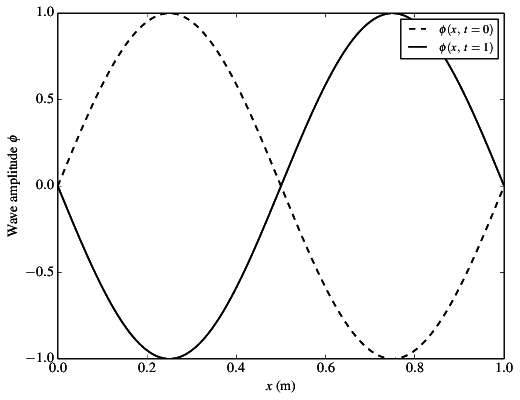
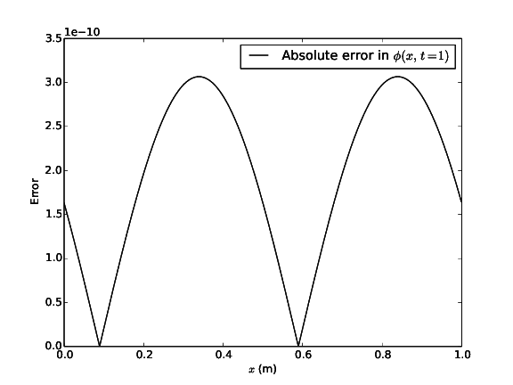

Application: 1D wave propagation
================================

Equations
---------

This test case solves the numerical solution of the one-dimensional wave equation, written as

.. math:: \frac{\partial \phi}{\partial t} = c\frac{\partial \phi}{\partial x},

where :math:`\phi`  is the transported quantity and :math:`c` is a known constant representing the wave speed (set to 0.5 m/s in this simulation).

Simulation setup
----------------

A domain of length :math:`0 \leq x \leq 1` m is considered, with grid spacing :math:`dx` = 0.001 m, and periodic boundaries. A fourth-order accurate central differencing scheme is used to spatially discretise the domain, and a third-order Runge-Kutta timestepping scheme is used to march the equation forward in time.

The initial condition is defined by

.. math:: \phi(x, t=0) = \sin(2\pi x),

The simulation was run with a timestep of :math:`dt = 4 \times 10^{-5}` s until time :math:`t` = 1 s.

Running and plotting results
----------------------------

The simulation can be run sequentially using

.. code-block:: bash

    python wave.py
    cd wave_opsc_code
    make wave_seq
    ./wave_seq
    
The state of the solution field at the finish time will be written to an HDF5 file called ``state.h5``. This file can be read, and the results plotted, using

.. code-block:: bash

    python plot.py wave_opsc_code
    
which will generate two figures; one showing the propagation of the initial sine wave (see ``phi.pdf`` and Figure phi_), and one showing the error between the analytical solution (i.e. the initial wave translated to the right by :math:`x = ct`) and the numerical solution (``phi_error.pdf`` and Figure phi_error_).

.. _phi:

   The solution field :math:`\phi` at time :math:`t` = 0 s and :math:`t` = 1 s
   
.. _phi_error:

   The error between the analytical solution and the numerical solution at time :math:`t` = 1 s.
